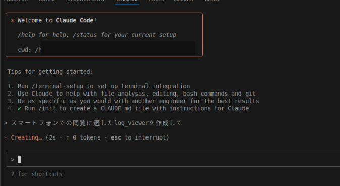
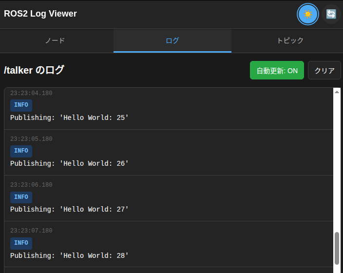

# Claude Code Demo - ROS 2 Log Viewer

This demo explores building a ROS 2 Viewer application using Claude Code.

## Demo Overview

This demo showcases Claude Code's ability to:
- Understand natural language requests in Japanese
- Create a complete web application with modern UI/UX
- Integrate with existing REST APIs
- Implement real-time log viewing functionality
- Apply responsive design and dark mode styling

## Demo Input and Output

### Input Prompt


The user requested in Japanese: 「スマートフォンでの閲覧に適したlog viewerを作成して」 (Create a log viewer suitable for smartphone viewing)

### Generated Output


Claude Code generated a complete mobile-friendly ROS 2 log viewer with:
- **Responsive Design**: Optimized for mobile devices
- **Real-time Updates**: Auto-refresh functionality for live log monitoring  
- **Dark Theme**: Modern dark UI with proper contrast
- **Japanese Localization**: Interface elements in Japanese
- **Tab Navigation**: Clean navigation between Nodes, Logs, and Topics
- **Log Level Indicators**: Color-coded log levels (INFO, WARN, ERROR, etc.)
- **Auto-scroll**: Automatic scrolling to newest log entries


## Usage Instructions

1. **Start the ROS 2 Console REST API**:
   ```bash
   docker compose up
   ```

2. **Open the generated log viewer** in your browser by navigating to the generated HTML file.


## Development Notes

- **API Compatibility**: Uses the existing ROS 2 Console REST API without modifications
- **Browser Support**: Compatible with modern mobile browsers
- **Performance**: Optimized for mobile network conditions
- **Accessibility**: Follows web accessibility guidelines

This demonstration shows how Claude Code can rapidly prototype and build functional applications from minimal natural language descriptions, making it an powerful tool for rapid development and prototyping.